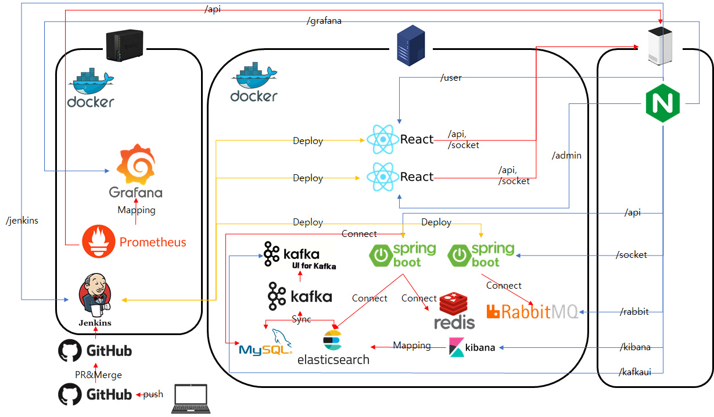
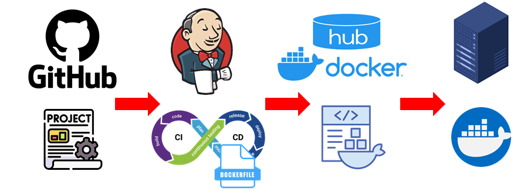

# E-BEAR
**고성능 E-Commerce 플랫폼**

E-BEAR는 Codabra 팀이 개발한 고성능 E-Commerce 플랫폼입니다. 안정적이고 통합된 모놀리식(Monolithic) 아키텍처를 기반으로 하며, Spring Boot 백엔드와 반응형 React 프론트엔드로 구성됩니다.

    * '고성능'이라는 목표를 달성하기 위해, 해당 시스템의 애플리케이션은 다양한 전문 미들웨어와 연동되는 구조를 가집니다.

    * 빠른 검색: Elasticsearch를 연동하여 복잡한 조건에서도 빠르고 정확한 상품 검색 기능을 제공합니다.

    * 성능 향상: Redis를 세션 스토리지 및 공통 데이터 캐시로 활용하여 DB 부하를 획기적으로 줄이고 사용자의 응답 속도를 향상시킵니다.

    * 데이터 동기화: Kafka와 Kafka Connector를 통해 메인 데이터베이스(MySQL)의 변경 이력을 Elasticsearch로 안정적으로 동기화하는 데이터 파이프라인을 구축했습니다.

    * 실시간 통신: WebSocket을 통해 사용자와 관리자간 메세지 기반 실시간 채팅 기능을 제공합니다.

## 🌟 주요 기능

* **기능1**: 설명
* **기능2**: 설명
* **기능3**: 설명
* **기능4**: 설명

## 🛠️ 기술 스택

| 구분          | 기술                                                     |
| :------------ | :------------------------------------------------------- |
| **Backend** | Java 17, Spring Boot, Spring Security, WebSocket |
| **Frontend** | HTML, CSS, JavaScript, React, MUI |
| **Database** | MySQL, JPA (Hibernate), Redis, ES |
| **MiddleWare** | Kafka, RabbitMQ, Kafka Connector |
| **Monitering** | Grafana, Prometheus, KafkaUI, Kibana |
| **CI/CD** | Jenkins |
| **Version Control** | Git, GitHub |
| **Build** | Gradle |
| **ETC** | Docker, DockerHub |

## ⚙️ 시스템 아키텍처



1.  **CI/CD 파이프라인 (Jenkins & GitHub)**: 
    * 개발자가 GitHub에 코드를 Push(or PR/Merge)하면, Jenkins가 Webhook을 통해 이를 감지합니다.
    * Jenkins는 코드를 빌드(Gradle)하고 Docker 이미지를 생성하여 DockerHub(또는 내부 레지스트리)에 Push합니다.
    * 이후 운영 서버(App Server)에 접속하여 최신 버전의 React(Frontend) 및 Spring Boot(Backend) 애플리케이션을 Deploy (배포)합니다.
2.  **요청 라우팅 (Nginx - Reverse Proxy)**:
    * 모든 외부 요청은 Nginx 리버스 프록시 서버를 통해 수신됩니다.
    * Nginx는 URL 경로(path)에 따라 요청을 적절한 서비스로 라우팅합니다.
        * /api, /socket (WebSocket) 요청은 Spring Boot 백엔드 서버로 전달됩니다.
        * /user, /admin 등 UI 요청은 React 프론트엔드 애플리케이션으로 전달됩니다.
        * /jenkins, /grafana, /kibana 등 관리/모니터링 도구는 해당 서비스의 URL로 매핑됩니다.
3.  **애플리케이션 서버 (React & Spring Boot)**:
    * 사용자용(React-User)과 관리자용(React-Admin) 프론트엔드 애플리케이션이 분리되어 배포됩니다.
    * Spring Boot 백엔드 서버는 비즈니스 로직, API 제공, 데이터베이스 연동(JPA)을 담당합니다.
    * WebSocket을 통해 실시간 채팅 알림 등 양방향 통신을 처리합니다.
4.  **메시징 및 데이터 처리 (Kafka & RabbitMQ)**:
    * Kafka: 대용량 트래픽 및 이벤트 스트리밍 처리에 사용됩니다. (예: 데이터 동기화)
    * RabbitMQ: 1:1채팅 메시지 전달(AMQP)에 사용됩니다.
5.  **데이터베이스 및 검색/캐시 (MySQL, ES, Redis)**:
    * MySQL: 회원 정보, 상품, 주문 내역 등 핵심 정형 데이터는 RDBMS인 MySQL에 JPA를 통해 저장됩니다.
    * Elasticsearch (ES): Kafka Connector (또는 Spring Boot 애플리케이션)가 MySQL의 변경 데이터를 감지(Sync)하여 ES로 동기화합니다. 이는 상품 검색과 같은 복잡한 검색 기능을 고속으로 처리하는 데 사용됩니다.
    * Redis: 공통 데이터 캐싱(Caching) 등에 사용되어 시스템의 응답 속도를 향상시킵니다.
6.  **모니터링 (Prometheus, Grafana, Kibana)**:
    * Prometheus가 Spring Boot Actuator 등을 통해 애플리케이션의 메트릭(성능 지표)을 주기적으로 수집(Scrape)합니다.
    * Grafana는 Prometheus가 수집한 데이터를 시각화하여 시스템 상태를 한눈에 볼 수 있는 대시보드를 제공합니다.
    * Kibana는 Elasticsearch에 적재된 데이터를, Kafka UI는 Kafka 토픽의 데이터를 시각적으로 모니터링하고 분석하는 데 사용됩니다.

## Jenkins Pipeline


1.  **소스 코드 관리 (GitHub)**: 
    * WebHook: 개발자가 새 코드를 GitHub에 푸시(Push)하면 이 변경 사항이 CI/CD 프로세스를 시작하는 신호(WebHook)가 됩니다.
2.  **빌드 및 테스트 자동화 (Jenkins)**:
    * CI (Continuous Integration): GitHub의 변경 사항을 Jenkins가 감지합니다.
    * 빌드: Jenkins는 GitHub에서 최신 코드를 가져와서 컴파일하고, 의존성을 설치하는 등 빌드 작업을 수행합니다.
    * 테스트: 이 과정에서 자동화된 테스트(단위 테스트, 통합 테스트 등)를 실행하여 코드의 품질을 검사합니다.
    * Dockerize: 빌드와 테스트가 성공하면, Jenkins는 프로젝트에 포함된 Dockerfile을 사용하여 애플리케이션을 Docker 이미지로 만듭니다.
3.  **이미지 저장 (Docker Hub)**:
    * CD (Continuous Delivery): Jenkins가 성공적으로 빌드한 Docker 이미지를 Docker Hub(Docker 이미지 저장소, Registry)에 푸시(Push)하여 업로드합니다.
4.  **애플리케이션 배포 (Server)**:
    * CD (Continuous Deployment): 실제 서비스가 운영 중인 배포 서버가 Jenkins로부터 배포 명령을 받습니다.
    * Pull & Run: 서버는 Docker Hub에서 방금 업로드된 새 Docker 이미지를 풀(Pull)하여 가져옵니다.
    * 실행: 서버는 기존에 실행 중이던 구버전의 컨테이너를 중지하고, 새로 받은 이미지를 Docker 컨테이너로 실행하여 애플리케이션 배포를 완료합니다.

## 🐳 Docker Command
0. **Docker Network**
```
docker network create myela
docker network create my-network
```

1.  **Jenkins**:
```
sudo docker run \
  -p 2222:8080 \
  -v #{volum-foler}:/var/jenkins_home \
  -v /var/run/docker.sock:/var/run/docker.sock \
  -e "JENKINS_OPTS=--prefix=/jenkins" \
  --group-add 999 \
  --name jenkins-ecommerce \
  -d jenkins/jenkins:lts
```

2. **Kafka**:
```
docker run -d --name broker \
    -p 49092:49092 \
    -p 9092:9092 \
    -p 9101:9101 \
    -e KAFKA_BROKER_ID=1 \
    -e KAFKA_ZOOKEEPER_CONNECT=zookeeper:2181 \
    -e KAFKA_LISTENER_SECURITY_PROTOCOL_MAP=PLAINTEXT:PLAINTEXT,PLAINTEXT_HOST:PLAINTEXT \
    -e KAFKA_LISTENERS=PLAINTEXT://0.0.0.0:49092,PLAINTEXT_HOST://0.0.0.0:9092 \
    -e KAFKA_ADVERTISED_LISTENERS=PLAINTEXT://broker:49092,PLAINTEXT_HOST://192.168.0.31:9092 \
    -e KAFKA_OFFSETS_TOPIC_REPLICATION_FACTOR=1 \
    -e KAFKA_TRANSACTION_STATE_LOG_MIN_ISR=1 \
    -e KAFKA_TRANSACTION_STATE_LOG_REPLICATION_FACTOR=1 \
    -e KAFKA_GROUP_INITIAL_REBALANCE_DELAY_MS=0 \
    -e KAFKA_JMX_PORT=9101 \
    -e KAFKA_JMX_HOSTNAME=localhost \
    --network my-network \
    confluentinc/cp-kafka:7.4.4
```

3. **Kafka Connector**:
```
docker run -d --name kafka-connector \
-p 8083:8083 \
-e CONNECT_BOOTSTRAP_SERVERS=broker:49092 \
-e CONNECT_REST_PORT=8083 \
-e CONNECT_GROUP_ID="quickstart-avro" \
-e CONNECT_CONFIG_STORAGE_TOPIC="quickstart-avro-config" \
-e CONNECT_OFFSET_STORAGE_TOPIC="quickstart-avro-offsets" \
-e CONNECT_STATUS_STORAGE_TOPIC="quickstart-avro-status" \
-e CONNECT_CONFIG_STORAGE_REPLICATION_FACTOR=1 \
-e CONNECT_OFFSET_STORAGE_REPLICATION_FACTOR=1 \
-e CONNECT_STATUS_STORAGE_REPLICATION_FACTOR=1 \
-e CONNECT_KEY_CONVERTER="org.apache.kafka.connect.json.JsonConverter" \
-e CONNECT_VALUE_CONVERTER="org.apache.kafka.connect.json.JsonConverter" \
-e CONNECT_INTERNAL_KEY_CONVERTER="org.apache.kafka.connect.json.JsonConverter" \
-e CONNECT_INTERNAL_VALUE_CONVERTER="org.apache.kafka.connect.json.JsonConverter" \
-e CONNECT_REST_ADVERTISED_HOST_NAME="localhost" \
-e CONNECT_LOG4J_ROOT_LOGLEVEL=WARN \
-e CONNECT_PLUGIN_PATH="/usr/share/java,/etc/kafka-connect/jars" \
-v $(pwd)/jars:/etc/kafka-connect/jars \
--network my-network \
confluentinc/cp-kafka-connect:7.4.4
```

4. **Elastic Search**:
```
sudo docker run -d \
--restart unless-stopped \
--name elasticsearch \
--network myela \
-p 9200:9200 -p 9300:9300 \
-e "discovery.type=single-node" \
-e "xpack.security.enabled=false" \
-e "ES_JAVA_OPTS=-Xms2g -Xmx2g" \
docker.elastic.co/elasticsearch/elasticsearch:8.17.2
```

5. **Kibana**:
```
sudo docker run -d \
--restart unless-stopped \
--name kibana \
--network myela \
-p 5601:5601 \
-e ELASTICSEARCH_HOSTS=http://elasticsearch:9200 \
-e SERVER_BASEPATH=/kibana \
docker.elastic.co/kibana/kibana:8.17.2
```

6. **Grafana**:
```
docker run -d --name grafana \
  -p 3838:3000 \
  -e "GF_SERVER_ROOT_URL=서버주소/grafana" \
  grafana/grafana
```

7. **Prometheus**:
```
docker run -d \
  --name prometheus \
  -p 9090:9090 \
  -v $(pwd)/prometheus.yml:/etc/prometheus/prometheus.yml \
  prom/prometheus
```

8. **Kafka UI**:
```
docker run -d --name kafka-ui \
  -p 9797:8080 \
  -e KAFKA_CLUSTERS_0_NAME=local \
  -e KAFKA_CLUSTERS_0_BOOTSTRAPSERVERS=broker:49092 \
  -e KAFKA_CLUSTERS_0_ZOOKEEPER=zookeeper:2181 \
  -e SERVER_SERVLET_CONTEXT_PATH=/kafkaui \
  --network my-network \
  provectuslabs/kafka-ui:latest
```

9. **RabbitMQ**:
```
  docker run -d \
    --restart unless-stopped \
    --name rabbitmq-stream \
    -p 5672:5672 \
    -p 15672:15672 \
    -p 61613:61613 \
    -e RABBITMQ_ERLANG_COOKIE="RabbitMQ-My-Cookies" \
    -e RABBITMQ_DEFAULT_USER="eCommerce" \
    -e RABBITMQ_DEFAULT_PASS="eCommerce" \
    -e RABBITMQ_MANAGEMENT_HTTP_ROOT_PREFIX=/rabbit \
    rabbitmq:3-management-alpine
```

10. **Redis**:
```
  docker run -d --name redis -p 6379:6379 redis:latest
```

11. **MySql**:
```
  docker run -d \
    --name mysql \
    --restart unless-stopped \
    -p 3306:3306 \
    -e MYSQL_ROOT_PASSWORD=root \
    -e MYSQL_DATABASE=ebear \
    -e MYSQL_USER=ecommerce \
    -e MYSQL_PASSWORD=ecommerce \
    mysql:latest
```

## Nginx Setting
nginx_folder_directory/conf/nginx.conf의 파일 내용을 현재 레포지토리 nginx.conf파일로 변경후 기동

## 참조
**Jenkins ssh등록 등**: https://velog.io/@hong-brother/jenkins-pipeline%EC%97%90%EC%84%9C-ssh-%EC%82%AC%EC%9A%A9

**Jenkins↔GitHub 설정**: https://dev-report.tistory.com/23